# SETTING UP LAMP STACK ON AWS

### REQUIREMENTS

- AWS account
- Command line shell, to be able to ssh into the hosted EC2 instance

## EC2 Instance

You need to first create an Ubuntu EC2 instance on AWS, you can follow this [tutorial](https://medium.com/nerd-for-tech/how-to-create-a-ubuntu-20-04-server-on-aws-ec2-elastic-cloud-computing-5b423b5bf635) to help you with that.

After creating the instance, you will have to connect using the keypair used in generating the instance.
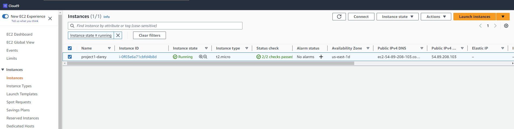
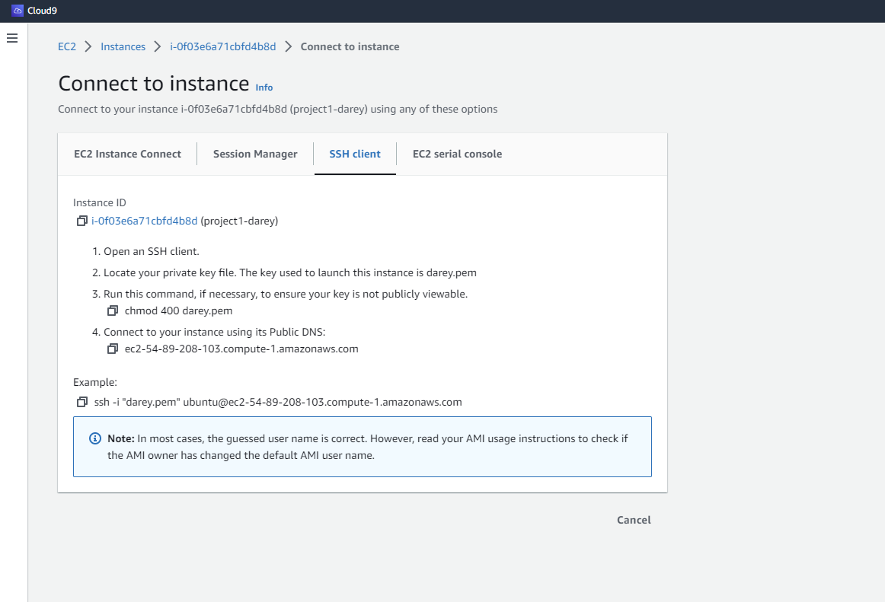

## Installing Apache

Apache Http Server is a web server software and it is highly customizable to meet the needs of different environments. To install this, first, you need to update the packages on our Ubuntu OS.

- Update the packages in Ubuntu `apt` package manager using `sudo apt update`.

  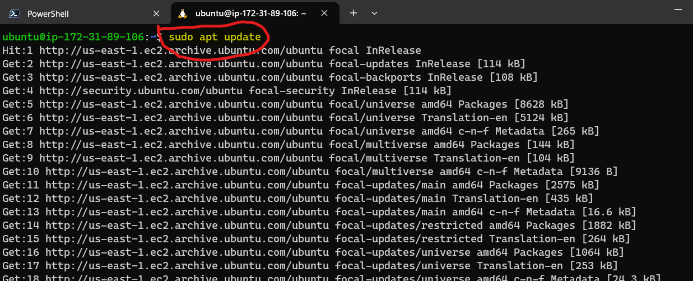

- Then install apache with this command `sudo apt install apache2`.

  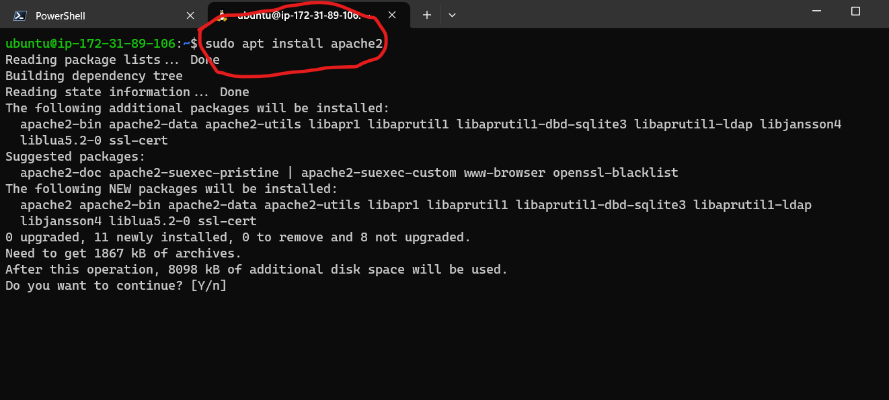

- Check Apache status using this command `sudo systemctl status apache2`.

  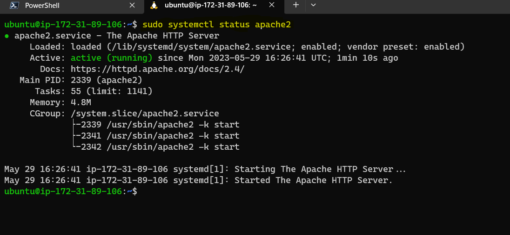

## Access default Apache page on the web

To do this, you will need to update the inbound rules of the security group on the EC2 instance by opening port 80 which will allow inbound HTTP traffic to the instance.

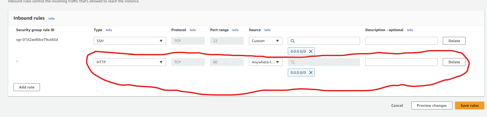

Once that is done, you can use the curl command `curl http://localhost:80` to access the page on your terminal
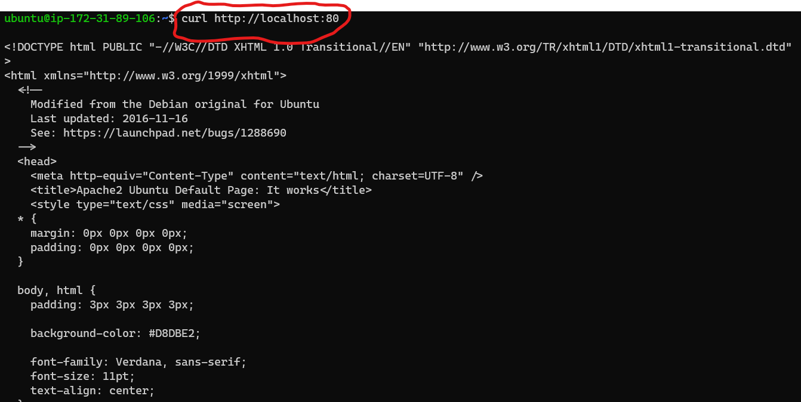

You can also view it on your browser using the EC2 public IP
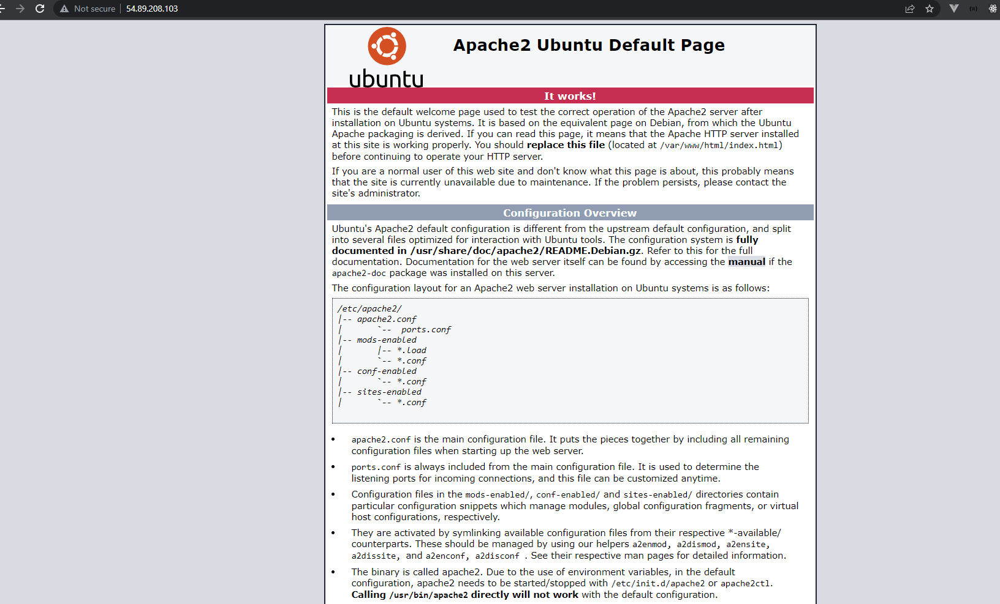

## Install MySQL

Now that the server is running, you can now install a DBMS(Database Management System), in this case it is MySQL

- Install this using the command `sudo apt install mysql-server` , when prompted, confirm the installation by typing `Y` or `y` , whichever is preferable.

- To check that the installation is successful, use the command `sudo mysql`, a prompt like the one in the image below should show up.

  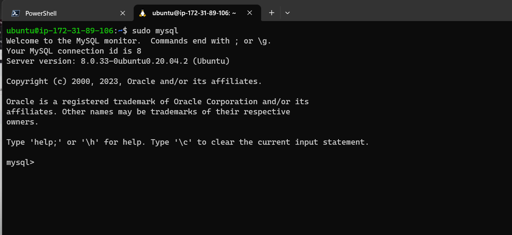

## SECURE THE DATABASE

it is recommended to run a security script that comes pre-installed with MySQL especially for production environments.

- Before running the script, a password for the root user must be defined, you can do this using the command `ALTER USER 'root'@'localhost' IDENTIFIED WITH mysql_native_password BY '<your password>';` replacing `<your password>` with what you want your password to be.

  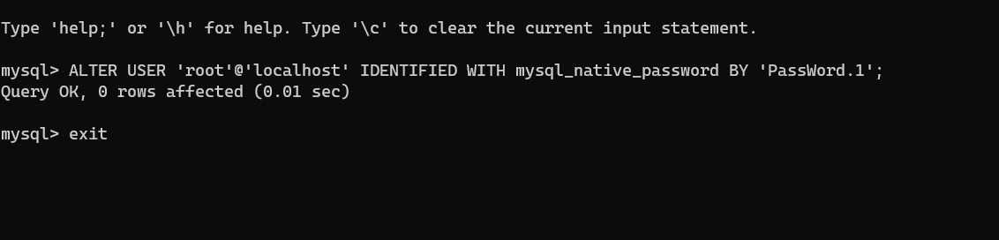

- You can then run the command `sudo mysql_secure_installation` to lock down access to your database following the additional prompts and making judgement calls on what you will like to be the default mode of the database

  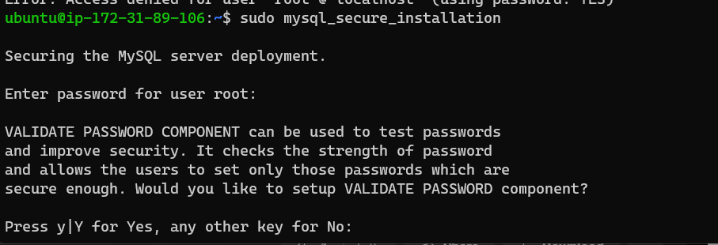

- Once that is done, you can exit the databse prompt by using the `exit` command.

- To test your connection to the database, you can use `sudo mysql -p`.

  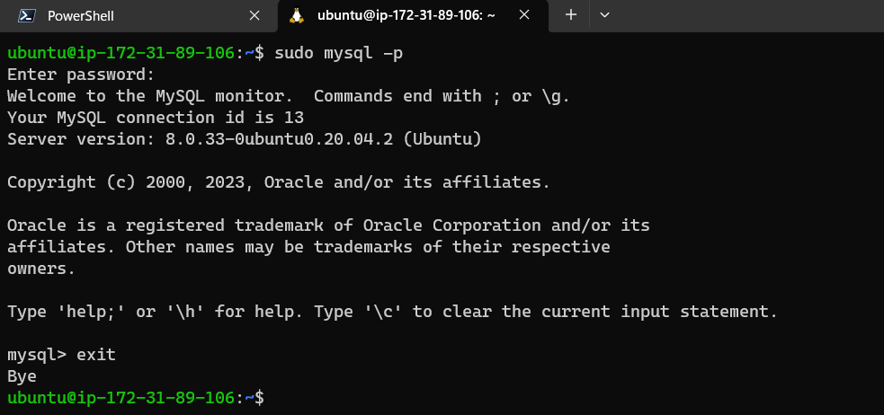

## SET UP PHP and it's dependencies

Apache and MySQL is now installed, now install PHP to process and display dynamic content to your user.

You will need to install `php`, `php-mysql` which is a module to allow php speak to the database and also `libapache2-mod-php` to enable Apache serve up php files.

To install the packages, you will use the command `sudo apt install php libapache2-mod-php php-mysql` and after installation, you can use `php -v` to confirm the php version and if the installation was successful.

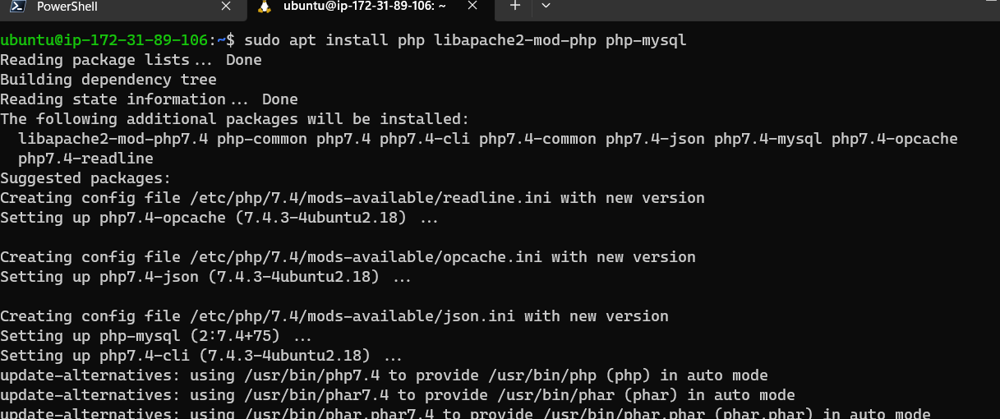

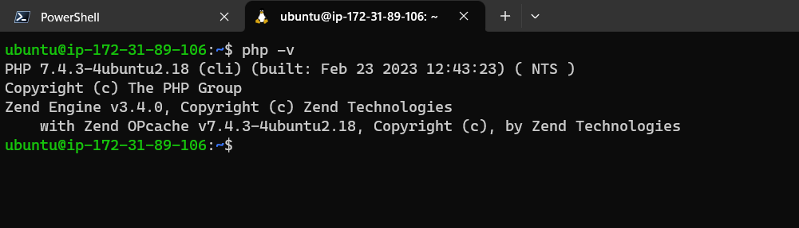

## CREATE VIRTUAL HOST USING APACHE

In case you want to set up a virtual host for your website, Apache on Ubuntu 20.0.3 by default serves up documents from **/var/www/html** directory, you are going to change it to serve from **/var/www/ptojectlamp**.

- First, create a directory for _projectlamp_ using `sudo mkdir /var/www/projectlamp` command

- Now, assign the ownership of the new directory to the surrent system user by using the command `sudo chown -R $USER:$USER /var/www/projectlamp`

- Create a new configuration file for Apache to serve up our website using the directory by running the command `sudo vi /etc/apache2/sites-available/projectlamp.conf`, this will create and open the file using Ubuntu's vi editor.

- press the _i_ on the keyboard to enter insert mode, then paste the following text in the file

```
 <VirtualHost *:80>
    ServerName projectlamp
    ServerAlias www.projectlamp
    ServerAdmin webmaster@localhost
    DocumentRoot /var/www/projectlamp
    ErrorLog ${APACHE_LOG_DIR}/error.log
    CustomLog ${APACHE_LOG_DIR}/access.log combined
</VirtualHost>
```

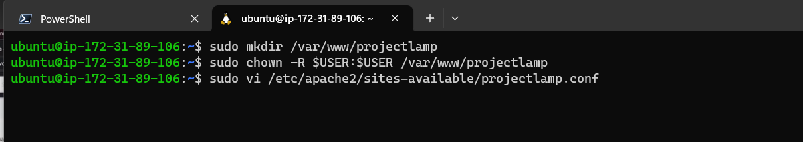
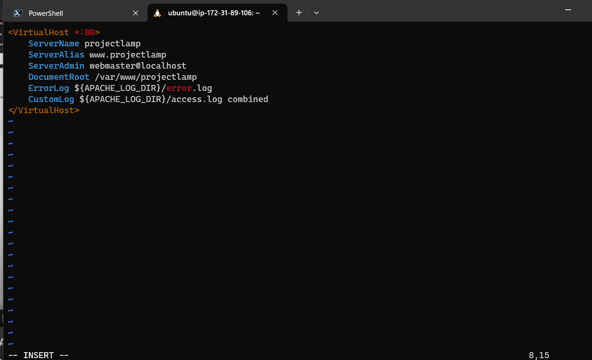

- To save and close the file, press the `esc` button and then type the command `:wq`.

- You can then see the new file in the directoty using `sudo ls /etc/apache2/sites-available`, this will show you a list of files like the one in the image below.

  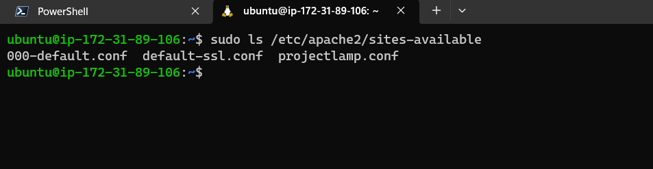

- To enable the new virtual host, use the command `sudo a2ensite projectlamp` and to disable the default apache site, use the command `sudo a2dissite 000-default`.

- To check that the configuration file does not contain syntax errors, run `sudo apache2ctl configtest` and finally reload apache using the command `sudo systemctl reload apache2`.
  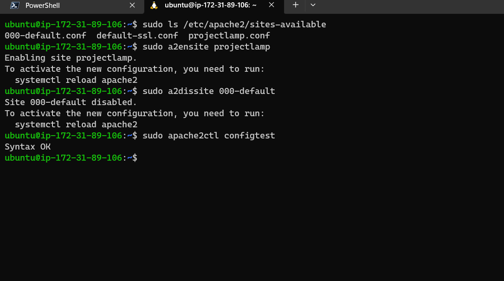

- Now that the new website is now active, you can create a default html file to be served when a user visits the page, use the command `sudo echo 'Hello LAMP from hostname' $(curl -s http://169.254.169.254/latest/meta-data/public-hostname) 'with public IP' $(curl -s http://169.254.169.254/latest/meta-data/public-ipv4) > /var/www/projectlamp/index.html` to create and append a line of text to index.html file in the projectlamp directory.

Once that is done, you can open the website URL and the page should be shown.
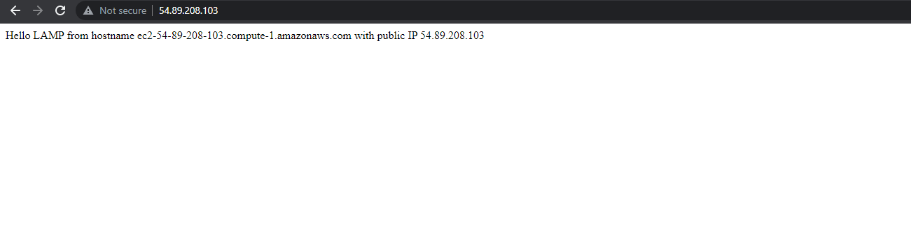

## Use PHP files rather than HTML

By default on Apache, index.html file takes precedence over index.php file, you can change this default behaviour by changing Apache's **DirectoryIndex** directive.

- Use the command `sudo vim /etc/apache2/mods-enabled/dir.conf` to open up the directive file and then move index.php to the front of the list.

```
<IfModule mod_dir.c>
        #Change this:
        #DirectoryIndex index.html index.cgi index.pl index.php index.xhtml index.htm
        #To this:
        DirectoryIndex index.php index.html index.cgi index.pl index.xhtml index.htm
</IfModule>
```

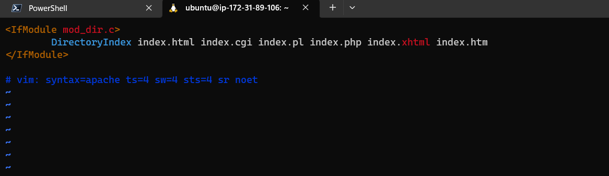

- Then you can create a new file and open it using the command `sudo vim /var/www/projectlamp/index.php`, then paste the following valid php code in the file:

```
<?php
phpinfo();
```

- if you don't want to change Apache's DirectoryIndex, you could just rename the previous index.html file to index.php using the command `mv /var/www/projectlamp/index.html /var/www/projectlamp/index.php` and then use the command `sudo vim /var/www/projectlamp/index.php` to open the file, replace the content with the php code above.
  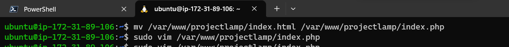.

- Save and close the file , refresh the page and you will see a page similar to the image below
  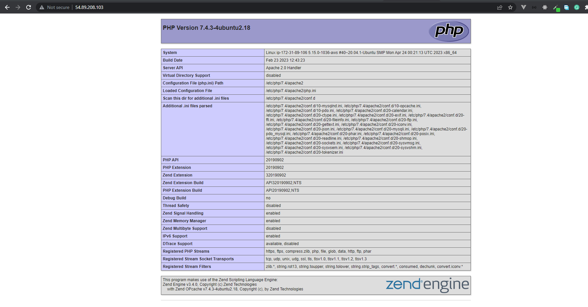

**Thank you!**
