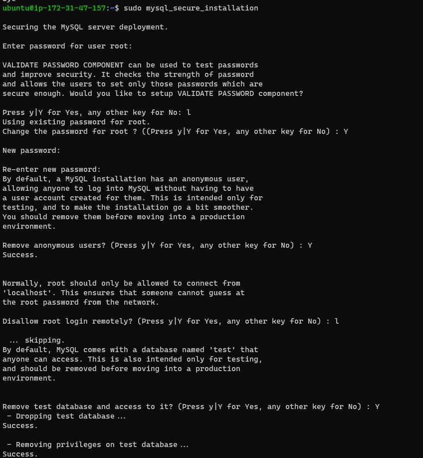

# SETTING UP LEMP STACK ON AWS

### REQUIREMENTS

- AWS account
- Command line shell, to be able to ssh into the hosted EC2 instance

## EC2 Instance

You need to first create an Ubuntu EC2 instance on AWS, you can follow this [tutorial](https://medium.com/nerd-for-tech/how-to-create-a-ubuntu-20-04-server-on-aws-ec2-elastic-cloud-computing-5b423b5bf635) to help you with that.

After creating the instance, you will have to connect using the keypair used in generating the instance.


## Installing Nginx

Nginx is a high performance web server. To install this, first, you need to update the packages on our Ubuntu OS.

- Update the packages in Ubuntu `apt` package manager using `sudo apt update`.

  

- Then install Nginx with this command `sudo apt install nginx`.

  

- Check Nginx status using this command `sudo systemctl status nginx`.

  

## Access default Nginx page on the web

To do this, you will need to update the inbound rules of the security group on the EC2 instance by opening port 80 which will allow inbound HTTP traffic to the instance.


Once that is done, you can use the curl command `curl http://localhost:80` to access the page on your terminal


You can also view it on your browser using the EC2 public IP


## Install MySQL

Now that the server is running, you can now install a DBMS(Database Management System), in this case it is MySQL

- Install this using the command `sudo apt install mysql-server` , when prompted, confirm the installation by typing `Y` or `y` , whichever is preferable.

- To check that the installation is successful, use the command `sudo mysql`, a prompt like the one in the image below should show up.

  

## SECURE THE DATABASE

it is recommended to run a security script that comes pre-installed with MySQL especially for production environments.

- Before running the script, a password for the root user must be defined, you can do this using the command `ALTER USER 'root'@'localhost' IDENTIFIED WITH mysql_native_password BY '<your password>';` replacing `<your password>` with what you want your password to be.

  

- You can then run the command `sudo mysql_secure_installation` to lock down access to your database following the additional prompts and making judgement calls on what you will like to be the default mode of the database

  

- Once that is done, you can exit the databse prompt by using the `exit` command.

- To test your connection to the database, you can use `sudo mysql -p`.

  

## SET UP PHP and it's dependencies

Nginx and MySQL is now installed, now install PHP to process and display dynamic content to your user.

You will need to install `php-fpm`, `php-mysql` which is a module to allow php speak to the database. `php-fpm` which stands for **PHP fastCGI process manager** tells Nginx to pass PHP requests to this software for processing, unlike Apache which embeds the PHP interpreter in each request, Nginx requires an external program to handle PHP processing.

To install the packages, you will use the command `sudo apt install php-fpm php-mysql` and after installation, you can use `php -v` to confirm the php version and if the installation was successful.


## Configure Nginx server blocks and the PHP processor

When using the Nginx web server, we can create server blocks(similar to virtual hosts in Apache) to encapsulate config details and host more than one domain on a single server

In our case we will serving up documents from **/var/www/projectLEMP**.

- First, create a directory for _projectLEMP_ using `sudo mkdir /var/www/projectLEMP` command

- Now, assign the ownership of the new directory to the surrent system user by using the command `sudo chown -R $USER:$USER /var/www/projectLEMP`


- Create a new configuration file for Nginx to serve up our website using the directory by running the command `sudo nano /etc/nginx/sites-available/projectLEMP`, this will create and open the file using Ubuntu's nano editor.

- Paste the following text in the file using _CTRL SHIFT V_

```
#/etc/nginx/sites-available/projectLEMP

server {
    listen 80;
    server_name projectLEMP www.projectLEMP;
    root /var/www/projectLEMP;

    index index.html index.htm index.php;

    location / {
        try_files $uri $uri/ =404;
    }

    location ~ \.php$ {
        include snippets/fastcgi-php.conf;
        fastcgi_pass unix:/var/run/php/php8.1-fpm.sock;
     }

    location ~ /\.ht {
        deny all;
    }

}
```

### Understanding the directives in the sites-available config

- _listen_ — Defines what port Nginx will listen on. In this case, it will listen on port 80, the default port for HTTP.
- _root_ — Defines the document root where the files served by this website are stored.
- _index_ — Defines in which order Nginx will prioritize index files for this website. It is a common practice to list index.html files with higher precedence than index.php files to allow for quickly setting up a maintenance landing page in PHP applications. You can adjust these settings to better suit your application needs.
- _server_name_ — Defines which domain names and/or IP addresses this server block should respond for. Point this directive to your server’s domain name or public IP address.
- _location /_ — The first location block includes a try_files directive, which checks for the existence of files or directories matching a URI request. If Nginx cannot find the appropriate resource, it will return a 404 error.
- _location ~ \.php$_ — This location block handles the actual PHP processing by pointing Nginx to the fastcgi-php.conf configuration file and the php7.4-fpm.sock file, which declares what socket is associated with php-fpm.
- _location ~ /\.ht_ — The last location block deals with .htaccess files, which Nginx does not process. By adding the deny all directive, if any .htaccess files happen to find their way into the document root, they will not be served to visitors.
- Take note of the php version in setting the conguration file in the `location` directive.


- To save and close the file, press the `CTRL X` button and then type the command `Y` and press the `ENTER` key.

- You can then activate your configuration using `sudo ln -s /etc/nginx/sites-available/projectLEMP /etc/nginx/site-enabled/`.

- To check that the configuration file does not contain syntax errors, run `sudo nginx -t`.


- Finally disable default nginx host that is currently configured to listen on port 80 by using `sudo unlink /etc/nginx/sites-enabled/default` and reload nginx to apply the changes by using `sudo systemctl reload nginx`.
  

- Now that the new website is now active, you can create a default html file to be served when a user visits the page, use the command `sudo echo 'Hello LEMP from hostname' $(curl -s http://169.254.169.254/latest/meta-data/public-hostname) 'with public IP' $(curl -s http://169.254.169.254/latest/meta-data/public-ipv4) > /var/www/projectLEMP/index.html` to create and append a line of text to index.html file in the projectLEMP directory.


Once that is done, you can open the website URL and the page should be shown.


## Use PHP files

The LEMP stack should be fully operational now, to validate that the server handles PHP files correctly...

- You can create a new file and open it using the command `sudo nano /var/www/projectLEMP/info.php`, then paste the following valid php code in the file:

```
<?php
phpinfo();
```


- Save and close the file, go to _domain-name_/info.php and you will see a page similar to the image below
  

## Retrieve data from MySQL database with PHP

Now you will craete a simple database and configure access to it so the Nginx website will be able to query the data and display it.

- To create a new database called _example_database_, we use the command `CREATE DATABASE `example_database`;`

- Create a new user named _example_user_ using _mysql_native_password_ as the default authentication method using the command ` CREATE USER 'example_user'@'%' IDENTIFIED WITH mysql_native_password BY 'password';`

- We can now give the user permission over the created database using `GRANT ALL ON example_database.* TO 'example_user'@'%';`


- You can now exit the MYSQL shell with the `exit` command

- To test that the new user has the proper permissions, log into the MYSQL console using the new user credentials `mysql -u example_user -p`, the `-p` flag will be used to prompt you for a password.

- use the `SHOW DATABASES;` command to confirm that the user has access to the database.

  

- create a table with name _todo_list_ in the database using the command `CREATE TABLE example_database.todo_list (item_id INT AUTO_INCREMENT,content VARCHAR(255),PRIMARY KEY(item_id));`

- Insert content using the command `INSERT INTO example_database.todo_list (content) VALUES ("My first important item");`

- To confirm that the data has been added, use the command to get all contents in the table `SELECT * FROM example_database.todo_list;`


- After confirming that the table contains valid data, create a todo_list php file using the command `nano /var/www/projectLEMP/todo_list.php` and add the following content to the file:

```
<?php
$user = "example_user";
$password = "password";
$database = "example_database";
$table = "todo_list";

try {
  $db = new PDO("mysql:host=localhost;dbname=$database", $user, $password);
  echo "<h2>TODO</h2><ol>";
  foreach($db->query("SELECT content FROM $table") as $row) {
    echo "<li>" . $row['content'] . "</li>";
  }
  echo "</ol>";
} catch (PDOException $e) {
    print "Error!: " . $e->getMessage() . "<br/>";
    die();
}
```


- Save and close the file and then visit the instance DNS address adding _/todo.php_ to the website url path, you should see the todo list from the database on the website.


Now you have set up a LEMP stack on an Ubuntu machine.

**Thank you**
