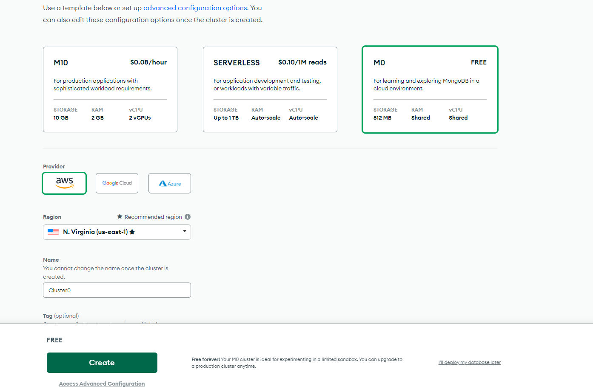
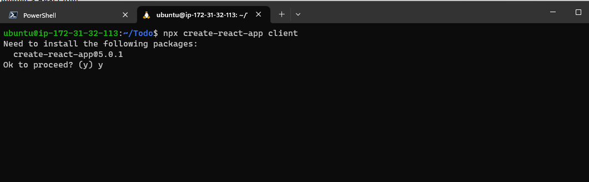
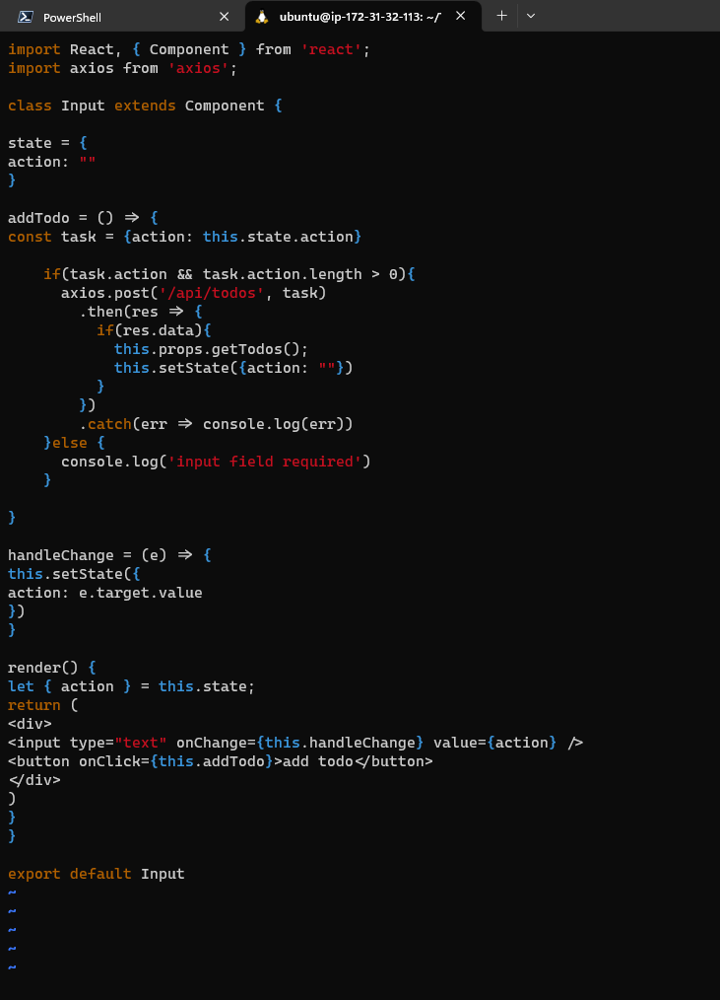

# SETTING UP MERN STACK ON AWS (Deploying a TODO account)

### REQUIREMENTS

- AWS account
- Command line shell, to be able to ssh into the hosted EC2 instance

## EC2 Instance

You need to first create an Ubuntu EC2 instance on AWS, you can follow this [tutorial](https://medium.com/nerd-for-tech/how-to-create-a-ubuntu-20-04-server-on-aws-ec2-elastic-cloud-computing-5b423b5bf635) to help you with that.

After creating the instance, you will have to connect using the keypair used in generating the instance.


## Installing Node and Creating Project directory

Node is built well to handle asynchronous JavaScript code to perform many asynchronous activities such as reading and writing to the file system, handling connections to database servers, or handling requests as a web server.

- Update the packages in Ubuntu `apt` package manager using `sudo apt update` then `sudo apt upgrade`.

  

- Get the location of Node.js software from Ubuntu repositories `curl -fsSL https://deb.nodesource.com/setup_18.x | sudo -E bash -`.

  

- Then install node using the command `sudo apt-get install -y nodejs`
  

- Verify the node installation with the command below `node -v` and for npm using `npm -v`.

  

- Create a new directory for the project using the command `mkdir Todo` and go into it using `cd Todo`

- To initialize the node project, use the command `npm init`
  

## Install ExpressJs and create the Routes directory

Express is a framework for Node to simplify development for the web.

- In the Todo folder, install Express using the command `npm install express`


- Create an index javascript file using the command `touch index.js`
  

  You can use the `ls` command to confirm if your file has been created.

- Install the dotenv module so your application can read .env files using the command `npm install dotenv`.


- Now edit the index.js and paste the code below in it, the code initializes the server using expressJS using the command `vi index.js` , after pasting the code below, you can exit the editor using `:wq`

```
const express = require('express');
require('dotenv').config();

const app = express();

const port = process.env.PORT || 5000;

app.use((req, res, next) => {
res.header("Access-Control-Allow-Origin", "\*");
res.header("Access-Control-Allow-Headers", "Origin, X-Requested-With, Content-Type, Accept");
next();
});

app.use((req, res, next) => {
res.send('Welcome to Express');
});

app.listen(port, () => {
console.log(`Server running on port ${port}`)
});
```


- Now, start the server using the command `node index.js`, this should start up the development server on port 5000 based on the code in index.js.
  

  Edit your EC2 security group inbound rules to add the 5000 port
  

- You can now visit the your site on the web attaching the port to the address to see the running server.
  

## Adding routes to the server

Let's add the routes to perform the three actions our ToDo application to Create a new task, Display a list of tasks and Delete a complete task.

- Make a routes directory using the command `mkdir routes` and change to the directory using the command `cd routes`

- Create a file `api.js` in this folder using the command `touch api.js` and then open the file to edit using `vi api.js`


- In the api.js , copy the code below and paste it in the file.

```
const express = require ('express');
const router = express.Router();

router.get('/todos', (req, res, next) => {

});

router.post('/todos', (req, res, next) => {

});

router.delete('/todos/:id', (req, res, next) => {

})

module.exports = router;
```


## Create DB models

Since the application is going to make use of MongoDB, we need to create a model.

- Change the directory back to the root Todo directory using the command `cd ..`

- Install Mongoose, a node.js package to make working with mongodb easier using the command `npm install mongoose`.

  

- Create a models folder with the command `mkdir models` and change the directory to it using `cd models`

- Create a todo.js file with the command `touch todo.js` and edit the file using `vi todo.js` and add the code below.

```
const mongoose = require('mongoose');
const Schema = mongoose.Schema;

//create schema for todo
const TodoSchema = new Schema({
action: {
type: String,
required: [true, 'The todo text field is required']
}
})

//create model for todo
const Todo = mongoose.model('todo', TodoSchema);

module.exports = Todo;
```


- Open the file api.js in the 'routes' directory and update it to make use of the new model, you can delete the code in vim editor using the command `:%d`.

```
const express = require ('express');
const router = express.Router();
const Todo = require('../models/todo');

router.get('/todos', (req, res, next) => {

//this will return all the data, exposing only the id and action field to the client
Todo.find({}, 'action')
.then(data => res.json(data))
.catch(next)
});

router.post('/todos', (req, res, next) => {
if(req.body.action){
Todo.create(req.body)
.then(data => res.json(data))
.catch(next)
}else {
res.json({
error: "The input field is empty"
})
}
});

router.delete('/todos/:id', (req, res, next) => {
Todo.findOneAndDelete({"_id": req.params.id})
.then(data => res.json(data))
.catch(next)
})

module.exports = router;
```

Vim Image


## Setting up MongoDB database.

We need to set up a database to store our data, for this we will create one on Mongo Atlas using mLab, [Sign Up Here](https://www.mongodb.com/atlas-signup-from-mlab), follow sign up process and select AWS as the cloud provider.



- Create a Username and password to connect to the DB and also configure the IP access list to allow connection from anywhere(this should be restricted in a production environment)
  

- In the root Todo directory, we will create an .env file to store our environment vriables. we can create this using the command `touch .env` and then edit the file to store our DB connection string from the MongoDB databse with the command `vi .env`. the connection string is in the form `DB = 'mongodb+srv://<username>:<password>@<network-address>/<dbname>?retryWrites=true&w=majority'`.


- Now we can update the index.js file to reflect the use of .env, we can update it using the vim editor. copy and paste the following code in the opened file.

```
const express = require('express');
const bodyParser = require('body-parser');
const mongoose = require('mongoose');
const routes = require('./routes/api');
const path = require('path');
require('dotenv').config();

const app = express();

const port = process.env.PORT || 5000;

//connect to the database
mongoose.connect(process.env.DB, { useNewUrlParser: true, useUnifiedTopology: true })
.then(() => console.log(`Database connected successfully`))
.catch(err => console.log(err));

//since mongoose promise is depreciated, we overide it with node's promise
mongoose.Promise = global.Promise;

app.use((req, res, next) => {
res.header("Access-Control-Allow-Origin", "\*");
res.header("Access-Control-Allow-Headers", "Origin, X-Requested-With, Content-Type, Accept");
next();
});

app.use(bodyParser.json());

app.use('/api', routes);

app.use((err, req, res, next) => {
console.log(err);
next();
});

app.listen(port, () => {
console.log(`Server running on port ${port}`)
```

- rerun the file using Node, a success db connection message should show up in the console.
  

## Testing Endpoints on Postman

Before setting up a frontend for the API, let's find test that the API endpoints are working properly, we can do this using Postman,install it [here](https://www.postman.com/).

- Open Postman and create a post request API to `http://<your-ec2-public-dns>:5000/api/todos`.

- Add a request header key of `Content-Type` with a value of `application/json`

- Add a request body with settings set to `raw` and `JSON`

```
{
    "action":"<anything you want to do>"
}
```


- Delete the newly created todo using the Delete method, passing the returned id of the todo in the url
  

- Try getting the list of todos now, you should get an empty array
  

### Create the FontEnd(React)

In the root Todo directory, create the React client app using the command `npx create-reaxt-app client`, this will create a folder called client in the root Todo directory


Now, before running the client, we will need to install some dependencies.

- Install concurrently using the command `npm install concurrently --save-dev`, this allows us to run more than one command simultaneously on same terminal window.

- Install nodeman using the command `npm install nodemon --save-dev` , it is used to run and monitor the server, it restars if there is a change in server code.


- In the root Todo folder, open the package.json file and update the scripts section using the code below.

```
"scripts": {
"start": "node index.js",
"start-watch": "nodemon index.js",
"dev": "concurrently \"npm run start-watch\" \"cd client && npm start\""
},
```


- Configure Proxy in client's package.json, go into the client's directory and update the package.json in vim using the command `vi package.json` and add the key-value pair in the file `"proxy": "http://localhost:5000"`, this makes it easier to call the server url using `localhost:5000` rather than `localhost:5000/api/todos`


- Update the EC2 security group to include port 3000

- Ensure you are in the root Todo dir, and run the command `nom run dev`, the app should open and start running on localhost:3000
  
  

## Create React Components

One of the advantages of react is that it makes use of components, which are reusable and also makes code modular

- Go to the client directory and move to the src directory and make a directory there with the name 'components', you can do all these with the command `cd client/src && mkdir components`

- Go into the components folder and create three files, Input.js, ListTodo.js and Todo.js with the command `touch Input.js ListTodo.js Todo.js`

- Go back to the client folder and install axios using `npm install axios`

- move to the components directory and update Input.js in vim editor using the code below

```
import React, { Component } from 'react';
import axios from 'axios';

class Input extends Component {

state = {
action: ""
}

addTodo = () => {
const task = {action: this.state.action}

    if(task.action && task.action.length > 0){
      axios.post('/api/todos', task)
        .then(res => {
          if(res.data){
            this.props.getTodos();
            this.setState({action: ""})
          }
        })
        .catch(err => console.log(err))
    }else {
      console.log('input field required')
    }

}

handleChange = (e) => {
this.setState({
action: e.target.value
})
}

render() {
let { action } = this.state;
return (
<div>
<input type="text" onChange={this.handleChange} value={action} />
<button onClick={this.addTodo}>add todo</button>
</div>
)
}
}

export default Input
```



- Update ListTodo.js in the vim editor and paste the code below.

```
import React from 'react';

const ListTodo = ({ todos, deleteTodo }) => {

return (
<ul>
{
todos &&
todos.length > 0 ?
(
todos.map(todo => {
return (
<li key={todo._id} onClick={() => deleteTodo(todo._id)}>{todo.action}</li>
)
})
)
:
(
<li>No todo(s) left</li>
)
}
</ul>
)
}

export default ListTodo
```


- Update Todo.js file as well, paste the code below.

```
import React, {Component} from 'react';
import axios from 'axios';

import Input from './Input';
import ListTodo from './ListTodo';

class Todo extends Component {

state = {
todos: []
}

componentDidMount(){
this.getTodos();
}

getTodos = () => {
axios.get('/api/todos')
.then(res => {
if(res.data){
this.setState({
todos: res.data
})
}
})
.catch(err => console.log(err))
}

deleteTodo = (id) => {

    axios.delete(`/api/todos/${id}`)
      .then(res => {
        if(res.data){
          this.getTodos()
        }
      })
      .catch(err => console.log(err))

}

render() {
let { todos } = this.state;

    return(
      <div>
        <h1>My Todo(s)</h1>
        <Input getTodos={this.getTodos}/>
        <ListTodo todos={todos} deleteTodo={this.deleteTodo}/>
      </div>
    )

}
}

export default Todo;
```


- Now, move to the src directory using the command `cd ..`, and open the App.JS file in vim editor and replace the contents with the code below.

```
import React from 'react';

import Todo from './components/Todo';
import './App.css';

const App = () => {
return (
<div className="App">
<Todo />
</div>
);
}

export default App;
```


- Update the App,css file as well using the code below to replace it's contents.

```
.App {
text-align: center;
font-size: calc(10px + 2vmin);
width: 60%;
margin-left: auto;
margin-right: auto;
}

input {
height: 40px;
width: 50%;
border: none;
border-bottom: 2px #101113 solid;
background: none;
font-size: 1.5rem;
color: #787a80;
}

input:focus {
outline: none;
}

button {
width: 25%;
height: 45px;
border: none;
margin-left: 10px;
font-size: 25px;
background: #101113;
border-radius: 5px;
color: #787a80;
cursor: pointer;
}

button:focus {
outline: none;
}

ul {
list-style: none;
text-align: left;
padding: 15px;
background: #171a1f;
border-radius: 5px;
}

li {
padding: 15px;
font-size: 1.5rem;
margin-bottom: 15px;
background: #282c34;
border-radius: 5px;
overflow-wrap: break-word;
cursor: pointer;
}

@media only screen and (min-width: 300px) {
.App {
width: 80%;
}

input {
width: 100%
}

button {
width: 100%;
margin-top: 15px;
margin-left: 0;
}
}

@media only screen and (min-width: 640px) {
.App {
width: 60%;
}

input {
width: 50%;
}

button {
width: 30%;
margin-left: 10px;
margin-top: 0;
}
}
```

- Open the index.css file in the src directory and replace it's contents with the code below.

```
body {
margin: 0;
padding: 0;
font-family: -apple-system, BlinkMacSystemFont, "Segoe UI", "Roboto", "Oxygen",
"Ubuntu", "Cantarell", "Fira Sans", "Droid Sans", "Helvetica Neue",
sans-serif;
-webkit-font-smoothing: antialiased;
-moz-osx-font-smoothing: grayscale;
box-sizing: border-box;
background-color: #282c34;
color: #787a80;
}

code {
font-family: source-code-pro, Menlo, Monaco, Consolas, "Courier New",
monospace;
}
```

## Run the working app

Go to the root Todo directory and run the command `npm run dev`, if the app runs successfully , we should get a screen where you can add your Todos like the image below.


And if you check the cloud Db, you should see your Todos there as well


Now you have set up a MERN stack on an Ubuntu machine.

**Thank you**
