# SETTING UP MERN STACK ON AWS (Deploying a TODO account)

### REQUIREMENTS

- AWS account
- Command line shell, to be able to ssh into the hosted EC2 instance

## EC2 Instance

You need to first create an Ubuntu EC2 instance on AWS, you can follow this [tutorial](https://medium.com/nerd-for-tech/how-to-create-a-ubuntu-20-04-server-on-aws-ec2-elastic-cloud-computing-5b423b5bf635) to help you with that.

After creating the instance, you will have to connect using the keypair used in generating the instance.
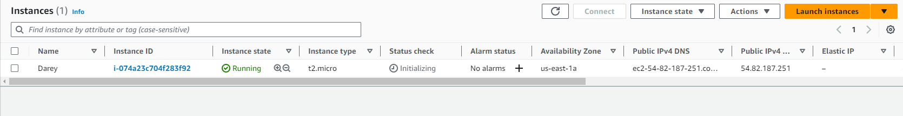
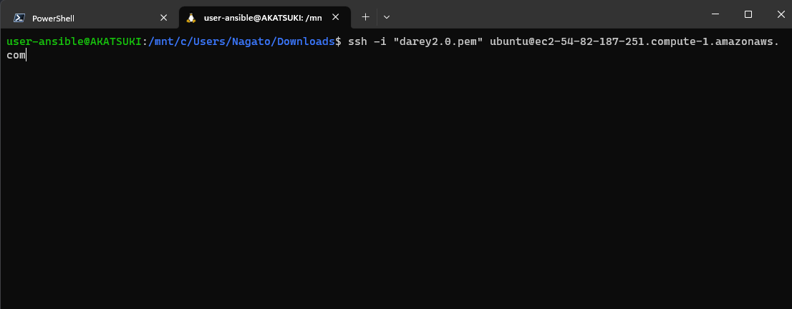

## Installing Node

Node is built well to handle asynchronous JavaScript code to perform many asynchronous activities such as reading and writing to the file system, handling connections to database servers, or handling requests as a web server.

- Update the packages in Ubuntu `apt` package manager using `sudo apt update` then `sudo apt upgrade`.

  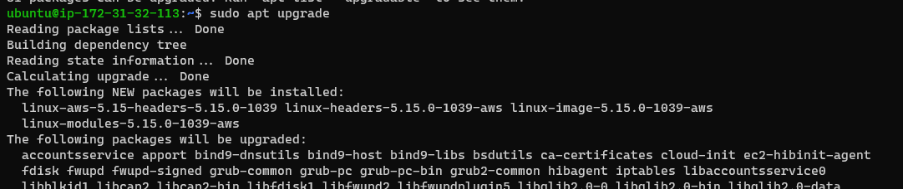

- Get the location of Node.js software from Ubuntu repositories `curl -fsSL https://deb.nodesource.com/setup_18.x | sudo -E bash -`.

  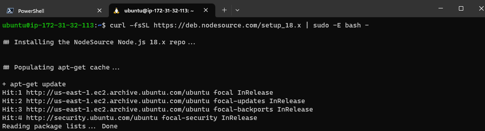

- Then install node using the command `sudo apt-get install -y nodejs`
  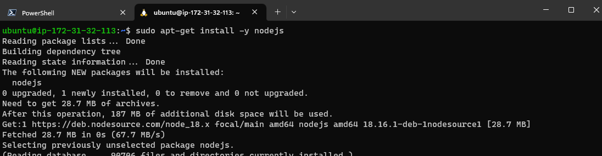

- Verify the node installation with the command below `node -v` and for npm using `npm -v`.

  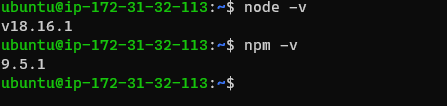

- Create a new directory for the project using the command `mkdir Todo` and go into it using `cd Todo`

## Install MongoDB, other packages and create project directory

MongoDB stores data in flexible, JSON-like documents. Fields in a database can vary from document to document and data structure can be changed over time.

- First, add resource to get MongoDB and verify source using the commands
  `sudo apt-key adv --keyserver hkp://keyserver.ubuntu.com:80 --recv 0C49F3730359A14518585931BC711F9BA15703C6`

  `echo "deb [ arch=amd64 ] https://repo.mongodb.org/apt/ubuntu trusty/mongodb-org/3.4 multiverse" | sudo tee /etc/apt/sources.list.d/mongodb-org-3.4.list`

- Install mongodb using the command `sudo apt install -y mongodb`

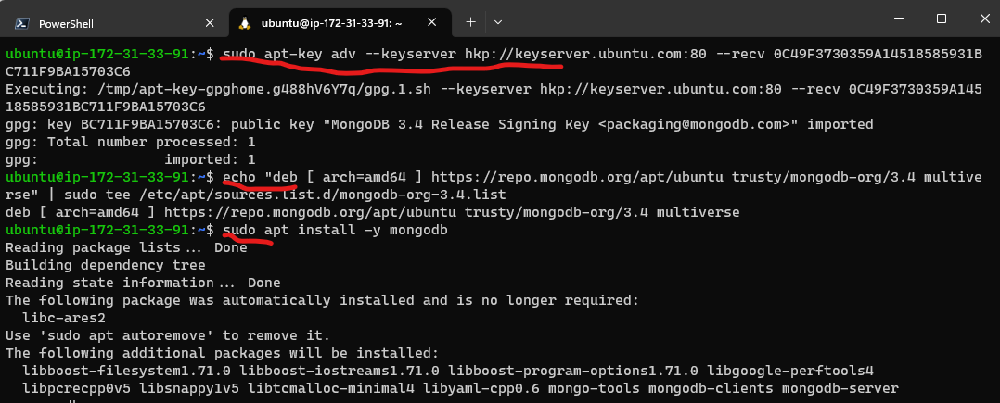

- Start the service using the command `sudo service mongodb start`

- Verify that the service is running using the command `sudo systemctl status mongodb`

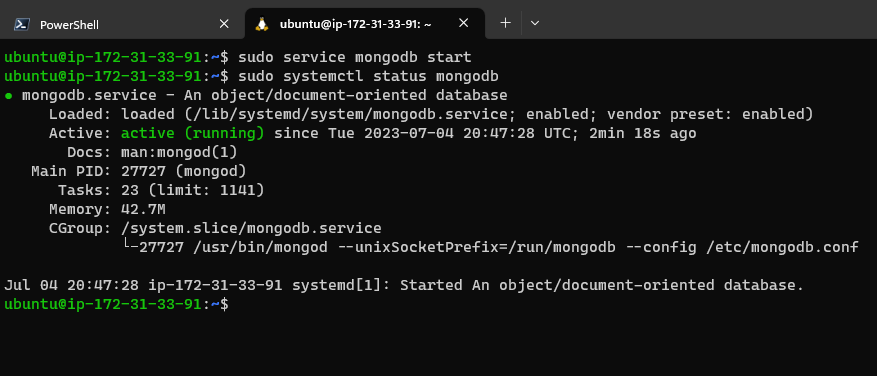

- Install body-parser package to process JSON files passed to the server `sudo npm install body-parser`.

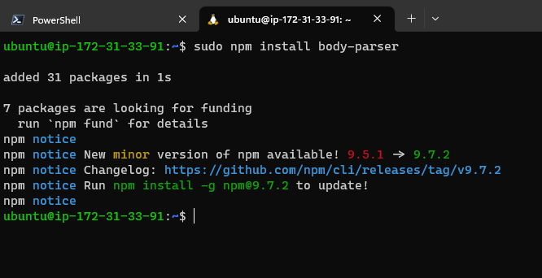

- Now create a directory calle Books and move into it using the command `mkdir Books && cd Books`

- To initialize the node project, use the command `npm init` in the Books directory

  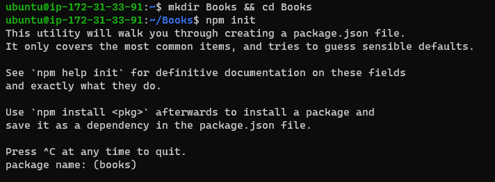

- Create a server.js file with vim uisng `vi server.js`, after pasting the code below use the command `:wq` to write and save the file.

```
var express = require('express');
var bodyParser = require('body-parser');
var app = express();
app.use(express.static(__dirname + '/public'));
app.use(bodyParser.json());
require('./apps/routes')(app);
app.set('port', 3000);
app.listen(app.get('port'), function() {
    console.log('Server up: http://localhost:' + app.get('port'));
});
```

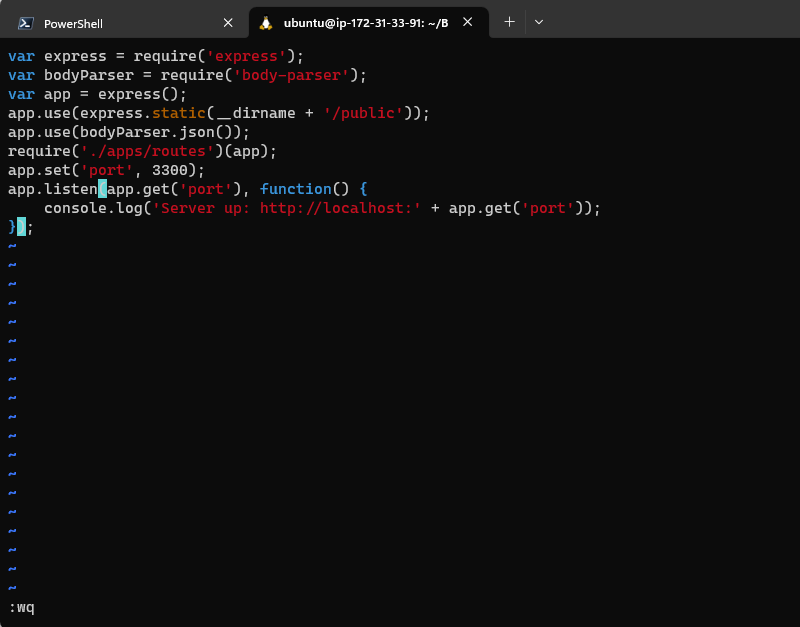

## Setup Routes to the server

Mongoose package provides a straight-forward, schema-based solution to model the application data.

- First, install mongoose and express using the command `sudo npm install express mongoose`

- In the Books folder, create a folder named apps and move into it using the command `mkdir apps && cd apps`

- Create a file routes.js with the command `vi routes.js` and update it with the code below.

```
const Book = require('./models/book');

module.exports = function(app){
  app.get('/book', function(req, res){
    Book.find({}).then(result => {
      res.json(result);
    }).catch(err => {
      console.error(err);
      res.status(500).send('An error occurred while retrieving books');
    });
  });

  app.post('/book', function(req, res){
    const book = new Book({
      name: req.body.name,
      isbn: req.body.isbn,
      author: req.body.author,
      pages: req.body.pages
    });
    book.save().then(result => {
      res.json({
        message: "Successfully added book",
        book: result
      });
    }).catch(err => {
      console.error(err);
      res.status(500).send('An error occurred while saving the book');
    });
  });

  app.delete("/book/:isbn", function(req, res){
    Book.findOneAndRemove(req.query).then(result => {
      res.json({
        message: "Successfully deleted the book",
        book: result
      });
    }).catch(err => {
      console.error(err);
      res.status(500).send('An error occurred while deleting the book');
    });
  });

  const path = require('path');
  app.get('*', function(req, res){
    res.sendFile(path.join(__dirname, 'public', 'index.html'));
  });
};
```


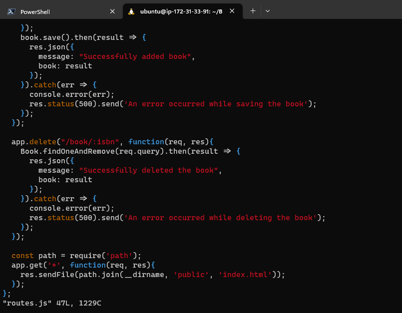

- In the apps folder, create a folder named models, move into it and create a file named book.js, do all these with commands `mkdir models && cd models && vi book.js`, copy and paste the code below into the book.js file

```
var mongoose = require('mongoose');
var dbHost = 'mongodb://localhost:27017/test';
mongoose.connect(dbHost);
mongoose.connection;
mongoose.set('debug', true);
var bookSchema = mongoose.Schema( {
  name: String,
  isbn: {type: String, index: true},
  author: String,
  pages: Number
});
var Book = mongoose.model('Book', bookSchema);
module.exports = mongoose.model('Book', bookSchema);
```

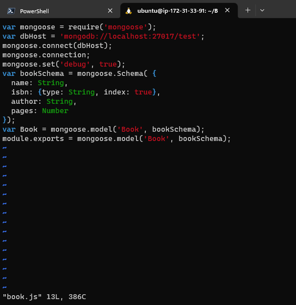

## Setup Client with Angular.js

AngularJS provides a web framework for creating dynamic views in your web applications.

- Go back to the root Books folder

- Create a folder called public and move into it `mkdie public && cd public`

- Create a file named script.js using th command `vi script.js` and update it with the code below

```
var app = angular.module('myApp', []);
app.controller('myCtrl', function($scope, $http) {
  $http( {
    method: 'GET',
    url: '/book'
  }).then(function successCallback(response) {
    $scope.books = response.data;
  }, function errorCallback(response) {
    console.log('Error: ' + response);
  });
  $scope.del_book = function(book) {
    $http( {
      method: 'DELETE',
      url: '/book/:isbn',
      params: {'isbn': book.isbn}
    }).then(function successCallback(response) {
      console.log(response);
    }, function errorCallback(response) {
      console.log('Error: ' + response);
    });
  };
  $scope.add_book = function() {
    var body = '{ "name": "' + $scope.Name +
    '", "isbn": "' + $scope.Isbn +
    '", "author": "' + $scope.Author +
    '", "pages": "' + $scope.Pages + '" }';
    $http({
      method: 'POST',
      url: '/book',
      data: body
    }).then(function successCallback(response) {
      console.log(response);
    }, function errorCallback(response) {
      console.log('Error: ' + response);
    });
  };
});
```

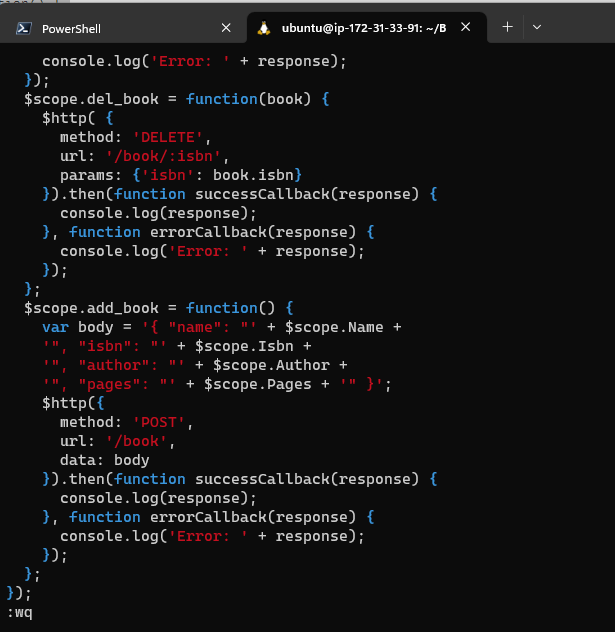

- Create another file named index.html and update it with the code below.

```
<!doctype html>
<html ng-app="myApp" ng-controller="myCtrl">
  <head>
    <script src="https://ajax.googleapis.com/ajax/libs/angularjs/1.6.4/angular.min.js"></script>
    <script src="script.js"></script>
  </head>
  <body>
    <div>
      <table>
        <tr>
          <td>Name:</td>
          <td><input type="text" ng-model="Name"></td>
        </tr>
        <tr>
          <td>Isbn:</td>
          <td><input type="text" ng-model="Isbn"></td>
        </tr>
        <tr>
          <td>Author:</td>
          <td><input type="text" ng-model="Author"></td>
        </tr>
        <tr>
          <td>Pages:</td>
          <td><input type="number" ng-model="Pages"></td>
        </tr>
      </table>
      <button ng-click="add_book()">Add</button>
    </div>
    <hr>
    <div>
      <table>
        <tr>
          <th>Name</th>
          <th>Isbn</th>
          <th>Author</th>
          <th>Pages</th>

        </tr>
        <tr ng-repeat="book in books">
          <td>{{book.name}}</td>
          <td>{{book.isbn}}</td>
          <td>{{book.author}}</td>
          <td>{{book.pages}}</td>

          <td><input type="button" value="Delete" data-ng-click="del_book(book)"></td>
        </tr>
      </table>
    </div>
  </body>
</html>
```

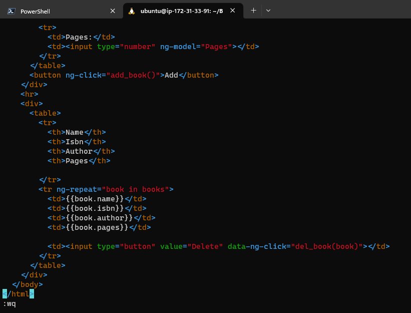

- Go back to the root Books folder and run the server,js using Node with the command `node server.js`

- Use the command `curl -s http://localhost:3000` to get the Html page in another terminal window

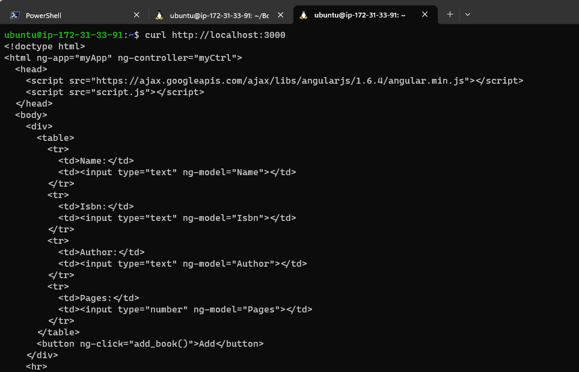

- Remember to add the Port to the Inbound EC2 security group
  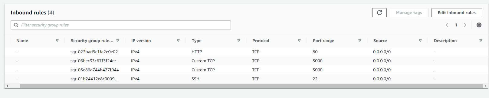

- You should see a page that looks like the one below when you run it in the browser using your EC2 DNS address and attaching the correct port so like this `http://<public DNS>:3000`

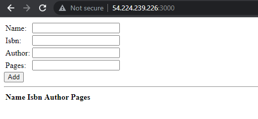

Now you have set up a MEAN stack on an Ubuntu machine.

**Thank you**
